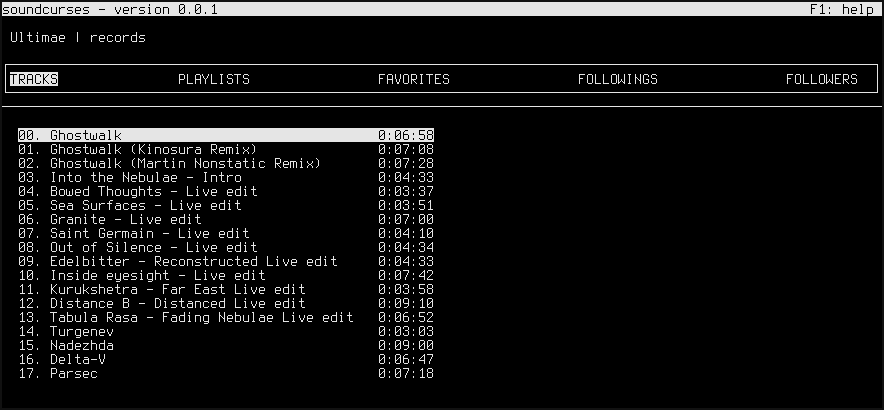

# soundcurses

A curses-based client for the SoundCloud music sharing platform.

Please note that this application is incomplete, pre-alpha, and still under development. *Tracks are not yet playable.* Many things are incomplete, suboptimal, and in need of revision.

## Install

```bash
cd /path/to/clone/dir
pip install -r requirements.txt
```

## Configure

To access the SoundCloud API and play tracks, you need to have a SoundCloud account and register a new SoundCloud "app."

1. Sign up or log in. [https://soundcloud.com](https://soundcloud.com/)
2. Register a new app. [https://developers.soundcloud.com](https://developers.soundcloud.com/)
3. Copy the Client ID of your new app. [https://soundcloud.com/you/apps](https://soundcloud.com/you/apps)
4. Paste the Client ID into soundcurses.py, replacing the existing, fake Client ID near line 53.

I'm aware that the necessity to edit a source file is quite bad. In the near future, I will use a config file in the OS user's config directory and will likely implement an input mechanism for the Client ID in the UI itself.

## Run

```bash
cd /path/to/clone/dir
python soundcurses.py
```
A modal prompt will be presented on startup into which one must enter a soundcloud.com username. The username of a soundcloud.com user is found in the URL path. For example, to access the SoundCloud assets of an artist called Edamame:

1. Navigate to the artist's soundcloud.com page.
  * Example: [https://soundcloud.com/edamame](https://soundcloud.com/edamame)
2. Extract the first URL path segment following the domain name.
  * Example: https//<i></i>soundcloud.com/**edamame**
  * Extract only the first segment. Incorrect: https//<i></i>soundcloud.com/**edamame/tracks**
3. Type or paste the username into the modal prompt and press Enter.

## Controls

A "subresource" is a SoundCloud user's tracks, favorite tracks, followers, etc.

Key | Action
--- | ---
c | Close modal window
q | Quit
u | Enter a soundcloud.com username
ArrowDown | Select next subresource in list
ArrowUp | Select previous subresource in list
PageDown | Scroll to next page of subresources in list
PageUp | Scroll to previous page of subresources in list
Tab | Cycle subresource categories of the current SoundCloud user
F1 | Show help
